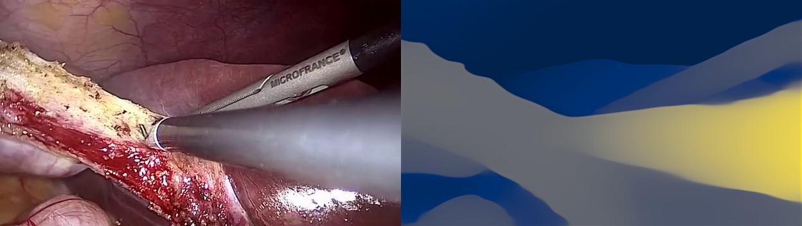

# Transferring Relative Monocular Depth to Surgical Vision with Temporal Consistency (MICCAI 2024)



This is the official repository for our state-of-the-art approach to monocular depth in surgical vision as presented in our paper...
<ul><b>Transferring Relative Monocular Depth to Surgical Vision with Temporal Consistency</b><br>
    Charlie Budd, and Tom Vercauteren.<br>
    [ <a href="https://doi.org/10.1007/978-3-031-72089-5_65">MICCAI</a>, <a href="https://arxiv.org/abs/2403.06683">arXiv</a> ] 
</ul>

# Using Our Models
First, install our package...
```
pip install git+https://github.com/charliebudd/transferring-relative-monocular-depth-to-surgical-vision
```
Then download one of our models weights from the [release tab](https://github.com/charliebudd/transferring-relative-monocular-depth-to-surgical-vision/releases/tag/model_release) in this repo. We would recommend our best performer, `depthanything-sup-temp.pt`. The model may then be used as follows...
```python
import torch
from torchvision.io import read_image
from torchvision.transforms.functional import resize
import matplotlib.pyplot as plt

from trmdsv import load_model

model, resize_for_model, normalise_for_model = load_model("depthanything", "weights/path.pt", "cuda")
model.eval()

image = read_image("surgical_image.png").cuda() / 255.0
original_size = image.shape[-2:]
image_for_model = normalise_for_model(resize_for_model(image.unsqueeze(0)))

with torch.no_grad():
    depth = model(image_for_model)

depth = resize(depth, original_size)

plt.subplot(121).axis("off")
plt.imshow(image.cpu().permute(1, 2, 0))
plt.subplot(122).axis("off")
plt.imshow(depth.cpu().permute(1, 2, 0))
plt.show()

```
# Recreating Our Results
To recreate our results first clone this repository and install all the requirements...
```
git clone https://github.com/charliebudd/transferring-relative-monocular-depth-to-surgical-vision
pip install -r requirements.txt
```
As the meta-dataset created for this project uses data with a mix of licenses, we are not able to redistribute our dataset. To recreate the dataset, you will first need to download all the input datasets. These datasets have different procedures to access, the starting point for each can be found with the following links...
##### Self-supervision data...
- ROBUST-MIS (Raw data): https://www.synapse.org/Synapse:syn18779624/wiki/591266
- Cholec80 (videos): http://camma.u-strasbg.fr/datasets/
##### Normal Supervision data...
- EndoVis2017: https://endovissub2017-roboticinstrumentsegmentation.grand-challenge.org/
- EndoVis2018: https://endovissub2018-roboticscenesegmentation.grand-challenge.org/
- KidneyBoundary: https://endovissub2017-kidneyboundarydetection.grand-challenge.org/
- Hamlyn (selected datasets only, see below): https://hamlyn.doc.ic.ac.uk/vision/
- StereoMIS: https://zenodo.org/records/7727692
##### Evaluation data...
- Serv-CT: https://www.ucl.ac.uk/interventional-surgical-sciences/weiss-open-research/weiss-open-data-server/serv-ct
- SCARED: https://endovissub2019-scared.grand-challenge.org/
  
For the hamlyn dataset a download script is provided to make the process easier...
```
bash download_hamlyn.sh
```
Download each dataset and place them in a shared directory. It should look like this...
```
Datasets
|
|____Cholec80
| |____videos
|
|____EndoVis2017
| |____test
| |____train
|
|____EndoVis2018
| |____test
| |____train
|
|____Hamlyn
| |____dataset4
| ⋮
|
|____KidneyBoundary
| |____kidney_dataset_1
| ⋮
|
|____ROBUST-MIS
| |____Raw data
|
|____SCARED
| |____dataset_1
| ⋮
|
|____SERV-CT
| |____Experiment_1
| |____Experiment_2
|
|____StereoMIS
| |____P1
| ⋮
```
Now run the data processing script provided to generate our meta-dataset
```
python data_preprocess.py --input-directory Datasets
```
You should now be ready to run the training script...
```
python train.py --experiment-name my-trained-model --model depthanything --train-mode sup temp
```
This will finetune depthanything using a combination of normal supervision (sup) and temporal consistency self-supervision (temp). You can then compare your finetuned model against the original depthanything model using the evaluation script...
```
python evaluate.py --model depthanything
python evaluate.py --model depthanything --weights outputs/my-trained-model/best_weights_validation.pt
```
